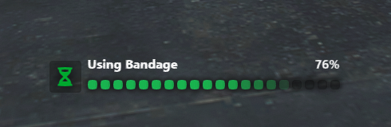

# FiveM Progress Bar

A lightweight and customizable HTML-based progress bar for FiveM. Supports both QBCore and standalone setups.

## 🎯 Features
- Clean animated UI (HTML/CSS/JS)
- Custom duration and label
- Callback support
- Easy to integrate into any script



## 🚀 Installation

1. Drag the folder into your `resources` directory.
2. Add the line to your `server.cfg`:


```cfg
ensure i3_progressbar
```

## Exports

# Progress Bar
```
exports.i3_progressbar:progressBar(data)

params:[
    data: 'table' [
        label: 'string',
        icon: 'string',
        duration: 'number',
        
        canCancel: 'boolean',
        useWhileDead: 'boolean',
        allowRagDoll: 'boolean',
        allowSwimming: 'boolean',
        allowCuffed: 'boolean',
        allowFalling: 'boolean',
        
        disable: 'table' [
            move: 'boolean',
            car: 'boolean',
            combat: 'boolean',
            mouse: 'boolean',
            sprint: 'boolean'
        ],
        anim: 'table' [
            dict: 'string',
            clip: 'string',
            scenario: 'string',
            flag: 'number',
            blendIn: 'float',
            blendOut: 'float',
            duration: 'number',
            playbackRate: 'number'
            lockX: 'boolean',
            lockY: 'boolean',
            lockZ: 'boolean',
            playEnter: 'boolean'
        ],
        prop: 'table' [
            bone: 'number',
            rotOrder: 'number',
            pos: 'table' [
                x: 'number',
                y: 'number',
                z: 'number',
            ],
            rot: 'table' [
                x: 'number',
                y: 'number',
                z: 'number',
            ]
        ]
    ]
]

Example:
local retreval = exports.i3_progressbar:progressBar({
        label = 'Example Progress Bar',
        duration = 5000,
        canCancel = true,
        disable = {
            car = true,
        },
        anim = {
            dict = 'mp_player_intdrink',
            clip = 'loop_bottle'
        },
        prop = {
            model = `prop_ld_flow_bottle`,
            pos = vec3(0.03, 0.03, 0.02),
            rot = vec3(0.0, 0.0, -1.5)
        },
})

if retreval then
    print('success')
else
    print('failed')
end
```

<!-- return the ran of state (true, false) -->


# Cancel
```
exports.ls_progressbar:cancel()
```

<!-- Cancel the current progress bar -->


# Is Progress Active
```
local retreval = exports.ls_progressbar:isProgressActive()

if retreval then
    print('progressbar is currently active')
else
    print('progressbar currently not active')
end
```

<!-- return the current progressbar state (true, false) -->

## For Ox_lib

```
function lib.progressBar(data)
    -- Ensure label and duration exist
    if not data.label or not data.duration then
        print('[ox_lib] Missing required label or duration for progress bar')
        return false
    end

    -- Optional fallback icon
    local icon = data.icon or 'fa-solid fa-hourglass-half'

    -- Build i3_progressbar-compatible table
    local progressData = {
        label = data.label,
        icon = icon,
        duration = data.duration,
        canCancel = data.canCancel ~= false, -- default true
        useWhileDead = data.useWhileDead or false,
        allowRagDoll = data.allowRagDoll or false,
        allowSwimming = data.allowSwimming or false,
        allowCuffed = data.allowCuffed or false,
        allowFalling = data.allowFalling or false,
        disable = data.disable or {
            move = true,
            car = true,
            combat = true
        },
        anim = data.anim,
        prop = data.prop
    }

    -- Call i3_progressbar
    local result = exports.i3_progressbar:progressBar(progressData)

    return result == true
end
```

